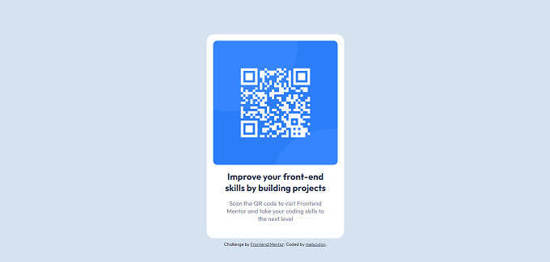

# Frontend Mentor - QR code component solution

This is a solution to the [QR code component challenge on Frontend Mentor](https://www.frontendmentor.io/challenges/qr-code-component-iux_sIO_H). Frontend Mentor challenges help you improve your coding skills by building realistic projects. 

## Table of contents

- [Overview](#overview)
  - [Screenshot](#screenshot)
  - [Links](#links)
- [My process](#my-process)
  - [Built with](#built-with)
  - [Continued development](#continued-development)
- [Author](#author)

## Overview

### Screenshot

### Links

- Solution URL: [Add solution URL here](https://github.com/melxcxtxn/frontendmentor_qr_code)
- Live Site URL: [Add live site URL here](https://your-live-site-url.com)

## My process

### Built with

- Semantic HTML5 markup
- CSS custom properties
- Flexbox
- Mobile-first workflow

### Continued development

I'm not comfortable with css yet. I'm not sure if it's shows but I feel like I need more practice to move things around. 

## Author

- Website - [melxcxtxn](https://github.com/melxcxtxn)
- Frontend Mentor - [@melxcxtxn](https://www.frontendmentor.io/profile/melxcxtxn)
- Twitter - [@melxcxtxn1](https://www.twitter.com/melxcxtxn1)

